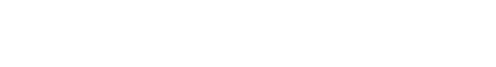

Šta je zapravo **MedMentum?**
---

**MedMentum** je napredan sistem za automatsko doziranje lekova, osmišljen da unapredi sigurnost i efikasnost u upravljanju terapijama. Kroz inovativni dizajn i preciznu tehnologiju, MedMentum omogućava pouzdano i jednostavno doziranje lekova, pružajući podršku kako pacijentima, tako i zdravstvenim radnicima.  

**Naša misija** 
---

Naša misija je da modernizujemo proces primene terapije, smanjujući rizik od grešaka u doziranju i povećavajući poverenje u medicinsku negu. Medmentum kombinuje tehnologiju i praktičnost kako bi svakodnevne terapije bile jednostavnije i sigurnije.  

**Ciljevi**
---

- **Preciznost:** Obezbeđivanje tačnog doziranja lekova u skladu s propisanom terapijom.  
- **Sigurnost:** Smanjenje rizika od grešaka i predoziranja kroz pametne sigurnosne mehanizme.  
- **Pristupačnost:** Jednostavno korišćenje za pacijente svih uzrasta i zdravstvenih stanja.  

**Ključne karakteristike**
---
- Pametni uređaj sa automatskom primenom lekova.  
- Integracija sa mobilnim aplikacijama za praćenje i prilagođavanje terapije.  
- Notifikacije i podsetnici za uzimanje lekova.  
- Sigurnosne funkcije poput zaključavanja i alarmiranja u slučaju nepravilnog korišćenja.

# **Informacije za članove tima 💻** 

## **Podele i Rokovi Zadataka 📄**

Sve relevantne informacije vezane za rokove, dodeljene zadatke i odgovornosti možete pronaći u dokumentu "[roadmap.md](https://github.com/nskemish/medmentum/blob/main/roadmap.md)" Molim vas da ga pregledate kako bi svi bili u toku sa svojim obavezama i napretkom projekta.

## **Potrebni Alati 🔧**

Sve o potrebnim alatima mozete pronaći na [tools.md](https://github.com/nskemish/medmentum/blob/main/tools.md), informacije poput instalacije **GitHub**-a, kao i pojedinačnog software-a koji su potrebni za realizaciju projekta.

